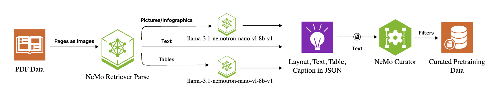

# Multimodal Extraction and Curation

## Workflow


## Overview
This tutorial demonstrates a comprehensive pipeline for extracting and curating multimodal content from PDF documents for domain-adaptive pre-training (DAPT). The tutorial is divided into two main parts that work together to create high-quality training datasets.

### Part 1: Multimodal Extraction
The first part focuses on extracting structured content from PDF documents using advanced AI models:

- **Document Layout Analysis**: Uses NVIDIA's NeMo Retriever Parse to identify and extract document elements (text, tables, charts, images) with precise bounding boxes
- **Content Analysis**: Leverages NVIDIA's Llama 3.1 Nemotron Nano VL model for deep analysis of visual content including:
  - Image classification (Infographics vs Other)
  - Detailed image descriptions and analysis
  - Table reconstruction from LaTeX to HTML format
  - Text content extraction and structuring

The extraction pipeline outputs structured JSON results containing extracted content, metadata, and analysis for each page and element, making it ideal for developing and validating data curation pipelines.

### Part 2: Data Curation for Domain-Adaptive Pre-Training (DAPT)
The second part covers best practices for data curation specifically designed for DAPT workflows. This stage processes the extracted text, tables, charts, and images using NeMo Curator's comprehensive curation pipeline to create high-quality training datasets.

## Prerequisites
Install required dependencies:
```bash
pip install -r requirements.txt
```

## Directory Structure
```
multimodal_pretraining_curation/
├── images/
│   └── workflow.png                # Workflow diagram
├── multimodal_extraction/          # Part 1: Extraction pipeline
│   ├── multimodal_extraction.py    # Main extraction script
│   ├── README.md                   # Detailed extraction guide
│   ├── source/                     # Input PDF URLs (pdf_urls.jsonl)
│   ├── extraction_results/         # Raw extraction output (auto-created)
│   └── categorized_results/        # Organized by modality (auto-created)
├── multimodal_curation/            # Part 2: Curation pipeline
│   ├── curator/                    # NeMo Curator configuration and scripts
│   └── README.md                   # Curation usage guide
├── requirements.txt                # Python dependencies
└── README.md                       # This file
```

## Quick Start

### Step 1: Run Multimodal Extraction
```bash
cd multimodal_extraction
python multimodal_extraction.py
```

This will:
- Download PDFs from the provided URLs in `source/pdf_urls.jsonl`
- Convert each page to high-resolution images
- Process through the two-stage analysis pipeline
- Save results as JSON files in `extraction_results/`

### Step 2: Run Data Curation
```bash
cd multimodal_curation/curator
# TODO
```

## License
Refer to the respective repositories for licensing information. This tutorial follows the Apache License 2.0 as specified in the NeMo Curator project.